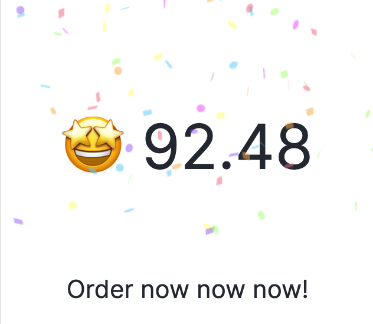

# Worth 🛒

A toy for bill analysis.

Online Demo: [https://worth.yuanx.me/](https://worth.yuanx.me/)

## Preview
### Enter
Goods name: `toothbrush`

Goods price: `1$`

Goods quantity: `1`

Monthly disposable amount: `1000$`

...


### Result




# Quick Start

```bash
$ yarn install
$ yarn dev
```

# Distribution

```bash
$ yarn build
```

# License
MIT